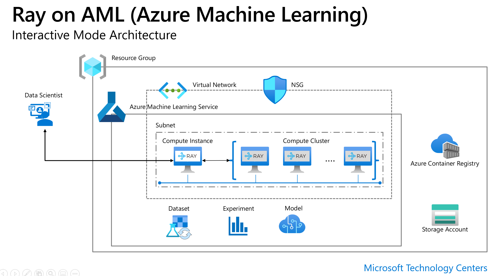

# Ray on Azure ML

This package simplifies setup of core Ray and Ray's components such as Dask on Ray, Ray tune,Ray rrlib, Ray serve in Azure ML.
It also comes with supports for high performance data access to Azure data sources such as Azure Storage, Delta Lake (coming soon), Synapse SQL (coming soon).
It supports both interactive and job uses.

## Architecture



## Setup


### 1. Prepare Azure ML environment

For interactive mode, setup a compute cluster and a compute instance in the same VNET.

Checklist 
> [ ] Azure Machine Learning Workspace
> 
> [ ] Virtual network/Subnet
>
> [ ] Create Compute Instance in the Virtual Network
> 
> [ ] Create Compute Cluster in the same Virtual Network

### 2. Select kernel 

Use a python 3.8+ conda environment from ```(Jupyter) Notebook``` in Azure Machine Learning Studio. 
> Note: Due to Conda env issue, VSCode is only supported for remote Ray cluster mode (```getRay(ci_is_head = False```)

### 3. Install library

```bash
pip install --upgrade ray-on-aml
```
> Installing this library will also install ```ray[tune]==1.9.1,  ray[serve]==1.9.1, pyarrow>= 5.0.0, dask[complete]==2021.12.0, adlfs==2021.10.0, fsspec==2021.10.1, xgboost_ray==0.1.6, fastparquet==0.7.2```

### 4. Run ray-on-aml
Run in interactive mode in a Compute Instance notebook

```python
from ray_on_aml.core import Ray_On_AML
ws = Workspace.from_config()
ray_on_aml =Ray_On_AML(ws=ws, compute_cluster ="Name_of_Compute_Cluster", maxnode=3) 
ray = ray_on_aml.getRay() 
# may take 7 mintues or longer.Check the AML run under ray_on_aml experiment for cluster status.  
```
Note that by default,the library sets up your current compute instance as Ray head and all nodes in the remote compute cluster as workers. 
If you want to use  one of the nodes in the remote AML compute cluster as head node and the remaining are worker nodes, simply pass ```ci_is_head=False``` 
to ```ray_on_aml.getRay()```.
To install additional library, use ```additional_pip_packages``` and ```additional_conda_packages``` parameters.
The ray cluster will request 5 nodes from AML if ``maxnode`` is not specified.
```python
ray_on_aml =Ray_On_AML(ws=ws, compute_cluster ="Name_of_Compute_Cluster", additional_pip_packages= \
['torch==1.10.0', 'torchvision', 'sklearn'])
```
Advanced usage:There are two arguments to Ray_On_AML() object initilization with to specify base configuration for the library with following default values.
Although it's possible, you should not change the default values of base_conda_dep  and base_pip_dep as it may break the package. Only do so when you need to customize the
cluster default configuration such as ray version.

```python
Ray_On_AML(ws=ws, compute_cluster ="Name_of_Compute_Cluster",base_conda_dep =['adlfs==2021.10.0','pip==21.3.1'],\ 
base_pip_dep = ['ray[tune]==1.9.1','ray[rllib]==1.9.1','ray[serve]==1.9.1', 'xgboost_ray==0.1.6', 'dask==2021.12.0',\
'pyarrow >= 5.0.0','fsspec==2021.10.1','fastparquet==0.7.2','tabulate==0.8.9'])
```

For use in an Azure ML job, include ray_on_aml as a pip dependency and inside your script, do this to get ray
```python

from ray_on_aml.core import Ray_On_AML
ray_on_aml =Ray_On_AML()
ray = ray_on_aml.getRay()

if ray: #in the headnode
    pass
    #logic to use Ray for distributed ML training, tunning or distributed data transformation with Dask

else:
    print("in worker node")
```
### 5. Ray Dashboard
The easiest way to view Ray dashboard is using the connection from [VSCode for Azure ML](https://code.visualstudio.com/docs/datascience/azure-machine-learning). 
Open VSCode to your Compute Instance then open a terminal, type http://127.0.0.1:8265/ then ctrl+click to open the Ray Dashboard.


This trick tells VScode to forward port to your local machine without having to setup ssh port forwarding using VScode's extension on the CI.


### 6. Shutdown ray cluster

To shutdown cluster,  run following.
```python
ray_on_aml.shutdown()
```

Check out [quick start examples](./examples/quick_use_cases.ipynb) to learn more 
