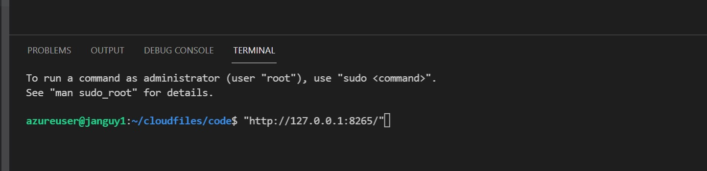
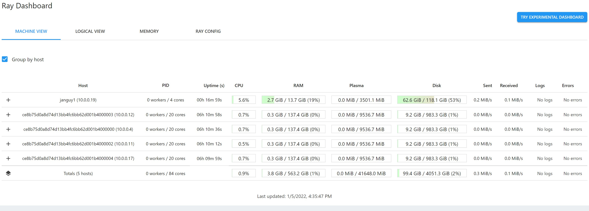

# Ray on Azure ML

This package simplifies setup of core Ray and Ray's components such as Dask on Ray, Ray tune,Ray rrlib, Ray serve and Spark in Azure ML worksapce.

It also comes with supports for high performance data access to Azure data sources such as Azure Storage, Delta Lake , Synapse SQL.

It supports both interactive and job use cases.


## Architecture


### [Updates 12/14/2022]


__Support AML SDK v2__

- If you have AML SDK v2 for python in your environment, Ray-On-AML will detect the SDK and leverage AML SDK v2 packages
- This package is still compatable with AML SDK v1.
- If you have both v1 and v2, then v2 will be used as a default.

__Better control of ray versions and ray packages by user__

- Users no longer need to use fixed packages that comes with Ray-On-AML. However user need to specify packages in the constructure of the Ray-On-AML class.

__Ability to mount inputs and outputs to ray cluster (with AML v2) for interactive use__

- No more download or move larger volume of data from Data Lake to compute cluster for processing. Just mounting Data, you can access for read and write data.
- Manage data using Data(Set) in AML, and use the name to mount for in/output
- You can read data as Arrow dataset or other dataframe for your project

__Support user define docker environment to greater customize ray environment__

- You can review and track change of Ray environment in AML Environment. Custom AML Environment will be automatically created when you add/remove package for the Ray cluster
- The environment for the Ray Cluster will be containerized and the container image will be reused when you try to use the same libraries or runtime environment

## Setup & Quick Start Guide

### 1. Prepare Azure Resources (infrastructure)

Make sure setup a compute cluster and a compute instance in the same VNET.

__Checklist for service provisioning__

> [ ] Azure Machine Learning Workspace
> 
> [ ] Virtual network/Subnet
>
> [ ] Network Security Group in/outbound
>
> [ ] Create Compute Instance in the Virtual Network
> 
> [ ] Create Compute Cluster in the same Virtual Network

### 2. Select kernel

Use a python 3.7+ conda environment from ```Notebook``` in Azure Machine Learning Studio or ```Jupyter Notebook``` in Azure Machine Learning Compute Instance (CI).

### 3. Install library

#### 3.1 Configure runtime environment in CI

Download and install packages for your project in CI 

For example, following python command will download and install `ray 2.2.0`, `Azure Machine Learning SDK v2 for python` and other packages

```bash
pip install --upgrade ray==2.2.0 ray[air]==2.2.0 ray[data]==2.2.0 azure-ai-ml ray-on-aml
```

The installed packages in CI will be automatially discoverd by the ray-on-aml during Compute Cluster setup

> Note: If you don't install Ray in CI, note that following packages and its version will be installed with ray-on-aml automatically
>
> ```ray[tune]==1.12.0,  ray[serve]==1.12.0, pyarrow>= 5.0.0, dask[complete]==2021.12.0, adlfs==2021.10.0, fsspec==2021.10.1, xgboost_ray==0.1.8, fastparquet==0.7.2```

### 4. Run ray-on-aml

There are two modes to run Ray.

- Client Mode
- Interative Cluster Mode
- Job

### 4.1. (MODE I.) Client mode

By default CI won't be part of Ray cluster but it will be used as a terminal to execute job on Ray running on Compute Cluster

```python
from ray_on_aml.core import Ray_On_AML
import logging

ray_on_aml =Ray_On_AML(ml_client=ml_client, compute_cluster ="{COMPUTE_CLUSTER_NAME}")

# May take 7 mintues or longer. Check the AML run under ray_on_aml experiment for cluster status.  
ray = ray_on_aml.getRay(num_node=2,pip_packages=["ray[air]==2.2.0","ray[data]==2.2.0","torch==1.13.0","fastparquet==2022.12.0", 
"azureml-mlflow==1.48.0", "pyarrow==6.0.1", "dask==2022.12.0", "adlfs==2022.11.2", "fsspec==2022.11.0"])

client = ray.init(f"ray://{ray_on_aml.headnode_private_ip}:10001")
```

If you ran above sample, make sure you have the same version of ray==2.2.0 in CI

### 4.2. (MODE II.) Interative Cluster mode

If you want to use CI as header node, then you have to use `ci_is_head = True` to make CI as a part of Ray cluster and act as Head node of the cluster

```python
from ray_on_aml.core import Ray_On_AML
import logging

ray_on_aml =Ray_On_AML(ml_client=ml_client, compute_cluster ="{COMPUTE_CLUSTER_NAME}")

# May take 7 mintues or longer. Check the AML run under ray_on_aml experiment for cluster status.  
# MODE II. CI as Ray cluster Header node
ray = ray_on_aml.getRay(ci_is_head=True, num_node=2)
```

> Note: To install additional library, use ```additional_pip_packages``` and ```additional_conda_packages``` parameters.
> The ray cluster will request 5 nodes from AML if ``maxnode`` is not specified.

### 4.3. (MODE III.) ray-on-aml in AML Job

To use in an Azure ML job, include ray_on_aml as a pip dependency and inside your script, do this to get ray
Remember to use RunConfiguration(communicator='OpenMpi') in your AML job's ScriptRunConfig so that ray-on-aml can work correctly.

```python
from azureml.core import Workspace, Experiment, Environment,ScriptRunConfig

from azureml.core.compute import ComputeTarget, AmlCompute
from azureml.core.compute_target import ComputeTargetException
from azureml.core.runconfig import RunConfiguration
from azureml.core.conda_dependencies import CondaDependencies
from azureml.core.runconfig import DockerConfiguration,RunConfiguration

#Remember the AML job has to have distribted setings (MPI type) for ray-on-aml to work correctly.
ws = Workspace.from_config()
compute_cluster = '{COMPUTE_CLUSTER_NAME}' #This can be another cluster different from the interactive cluster. 
ray_cluster = ComputeTarget(workspace=ws, name=compute_cluster)

aml_run_config_ml = RunConfiguration(communicator='OpenMpi')
docker_config = DockerConfiguration(use_docker=True, shm_size='48gb')


rayEnv = Environment.from_conda_specification(name = "RLEnv",
                                             file_path = "conda_env.yml")
rayEnv.docker.base_image = "mcr.microsoft.com/azureml/openmpi4.1.0-cuda11.1-cudnn8-ubuntu18.04:20220329.v1"

aml_run_config_ml.target = ray_cluster
aml_run_config_ml.node_count = 2
aml_run_config_ml.environment = rayEnv
aml_run_config_ml.docker =docker_config

src = ScriptRunConfig(source_directory='../examples/job',
                    script='aml_job.py',
                    run_config = aml_run_config_ml,
                   )

run = Experiment(ws, "rl_on_aml_job").submit(src)
```

### 5. (AML SDK v2 only) Mount Data(Set) to CC

If you are using AML SDK v2, you can mount Data(Set) to Compute Cluster

```python
from azure.ai.ml import command, Input, Output
from ray_on_aml.core import Ray_On_AML
import logging

ray_on_aml =Ray_On_AML(ml_client=ml_client, compute_cluster ="{COMPUTE_CLUSTER_NAME}")

inputs={
    "Input1": Input(
        type="uri_folder",
        path="azureml://datastores/{Data(Set)NAME}/paths/{FolderName}",
    )
}

outputs={
    "Output1": Output(
        type="uri_folder",
        path="azureml://datastores/{Data(Set)NAME}/paths/{FolderName}",
    ),
    "output2": Output(
        type="uri_folder",
        path="azureml://datastores/{Data(Set)NAME}/paths/{FolderName}",
    )
}

ray = ray_on_aml.getRay(inputs = inputs, outputs=outputs, num_node=2,
pip_packages=["ray[air]==2.2.0","ray[data]==2.2.0","torch==1.13.0","fastparquet==2022.12.0", 
"azureml-mlflow==1.48.0", "pyarrow==6.0.1", "dask==2022.2.0", "adlfs==2022.11.2", "fsspec==2022.11.0"])

client = ray.init(f"ray://{ray_on_aml.headnode_private_ip}:10001")
```

### 6. Ray Dashboard

The easiest way to view Ray dashboard is using the connection from [VSCode for Azure ML](https://code.visualstudio.com/docs/datascience/azure-machine-learning). 
Open VSCode to your Compute Instance then open a terminal, type http://127.0.0.1:8265/ then ctrl+click to open the Ray Dashboard.


This trick tells VScode to forward port to your local machine without having to setup ssh port forwarding using VScode's extension on the CI.




### 7. Shutdown ray cluster

> IMPORTANT: To stop Compute Cluster, you must run shutdown function. And also note that, this function won't stop CI, it only shutdown CC

To shutdown cluster,  run following

```python
ray_on_aml.shutdown()
```

### 8. Customize Ray version and the library's base configurations

Interactive cluster: There are two arguments in Ray_On_AML() class initilization to specify AML Workspace and Compute Cluster. And then you can define runtime environment using `getRay()` function of the Ray_on_AML object. 

```python
ray_on_aml =Ray_On_AML(ml_client=ml_client, compute_cluster ="{COMPUTE_CLUSTER_NAME}")

ray = ray_on_aml.getRay(inputs = inputs, outputs=outputs, num_node=2,
pip_packages=["ray[air]==2.2.0","ray[data]==2.2.0","torch==1.13.0","fastparquet==2022.12.0", 
"azureml-mlflow==1.48.0", "pyarrow==6.0.1", "dask==2022.2.0", "adlfs==2022.11.2", "fsspec==2022.11.0"])
```

By default you don't need to provide ray or its version in the getRay function because Ray_On_AML will automatically detect the version of Ray package and will include the package in the pip_packages list.

However, you can change ray and other libraries versions in the pip_packages list. Do this with extreme care as it may result in conflicts impacting intended features of the package.

And also note that if you change ray version here, you will need to manually re-install the ray library at the compute instance to match with the custom version of the cluster in case the compute instance is the head node.

AML Job cluster: If you need to customize your ray version, you can do so by adding ray dependency after ray-on-aml. The reason is ray-on-aml comes with some recent ray version. It needs to be overidden. For example if you need ray 0.8.7, you can do like following in your job's env.yml file

```python
      - ray-on-aml==0.2.2
      - ray[rllib,tune,serve]==2.2.0
```

Check out [RLlib example with customized ray version](./examples/rl/rl_main.ipynb) to learn more

### 9. Quick start examples

Check out [quick start examples](./examples/quick_start_examples.ipynb) to learn more

## Contributing

This project welcomes contributions and suggestions.  Most contributions require you to agree to a
Contributor License Agreement (CLA) declaring that you have the right to, and actually do, grant us
the rights to use your contribution. For details, visit https://cla.opensource.microsoft.com.

When you submit a pull request, a CLA bot will automatically determine whether you need to provide
a CLA and decorate the PR appropriately (e.g., status check, comment). Simply follow the instructions
provided by the bot. You will only need to do this once across all repos using our CLA.

This project has adopted the [Microsoft Open Source Code of Conduct](https://opensource.microsoft.com/codeofconduct/).
For more information see the [Code of Conduct FAQ](https://opensource.microsoft.com/codeofconduct/faq/) or
contact [opencode@microsoft.com](mailto:opencode@microsoft.com) with any additional questions or comments.

## Trademarks

This project may contain trademarks or logos for projects, products, or services. Authorized use of Microsoft 
trademarks or logos is subject to and must follow 
[Microsoft's Trademark & Brand Guidelines](https://www.microsoft.com/en-us/legal/intellectualproperty/trademarks/usage/general).
Use of Microsoft trademarks or logos in modified versions of this project must not cause confusion or imply Microsoft sponsorship.
Any use of third-party trademarks or logos are subject to those third-party's policies.

## Security

Microsoft takes the security of our software products and services seriously, which includes all source code repositories managed through our GitHub organizations, which include [Microsoft](https://github.com/Microsoft), [Azure](https://github.com/Azure), [DotNet](https://github.com/dotnet), [AspNet](https://github.com/aspnet), [Xamarin](https://github.com/xamarin), and [our GitHub organizations](https://opensource.microsoft.com/).

If you believe you have found a security vulnerability in any Microsoft-owned repository that meets [Microsoft's definition of a security vulnerability](https://docs.microsoft.com/en-us/previous-versions/tn-archive/cc751383(v=technet.10)), please report it to us as described below.

## Reporting Security Issues

**Please do not report security vulnerabilities through public GitHub issues.**

Instead, please report them to the Microsoft Security Response Center (MSRC) at [https://msrc.microsoft.com/create-report](https://msrc.microsoft.com/create-report).

If you prefer to submit without logging in, send email to [secure@microsoft.com](mailto:secure@microsoft.com).  If possible, encrypt your message with our PGP key; please download it from the [Microsoft Security Response Center PGP Key page](https://www.microsoft.com/en-us/msrc/pgp-key-msrc).

You should receive a response within 24 hours. If for some reason you do not, please follow up via email to ensure we received your original message. Additional information can be found at [microsoft.com/msrc](https://www.microsoft.com/msrc). 

Please include the requested information listed below (as much as you can provide) to help us better understand the nature and scope of the possible issue:

  * Type of issue (e.g. buffer overflow, SQL injection, cross-site scripting, etc.)
  * Full paths of source file(s) related to the manifestation of the issue
  * The location of the affected source code (tag/branch/commit or direct URL)
  * Any special configuration required to reproduce the issue
  * Step-by-step instructions to reproduce the issue
  * Proof-of-concept or exploit code (if possible)
  * Impact of the issue, including how an attacker might exploit the issue

This information will help us triage your report more quickly.

If you are reporting for a bug bounty, more complete reports can contribute to a higher bounty award. Please visit our [Microsoft Bug Bounty Program](https://microsoft.com/msrc/bounty) page for more details about our active programs.


## Preferred Languages

We prefer all communications to be in English.

## Policy

Microsoft follows the principle of [Coordinated Vulnerability Disclosure](https://www.microsoft.com/en-us/msrc/cvd).
